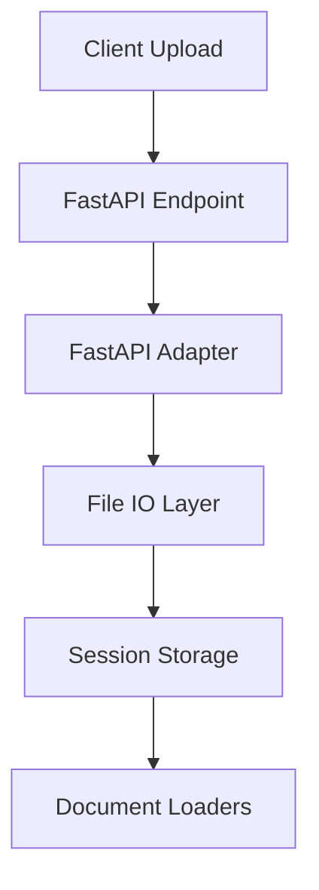
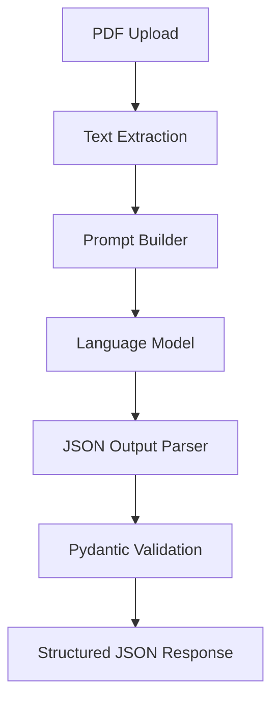
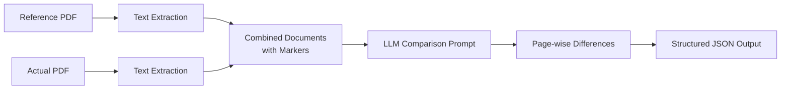
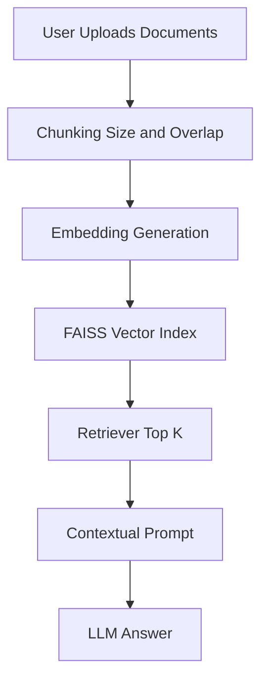
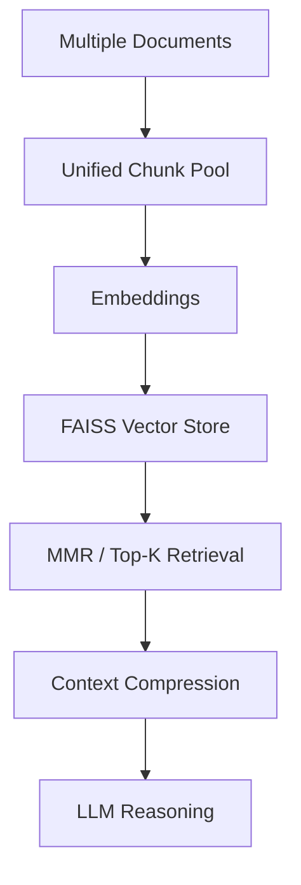
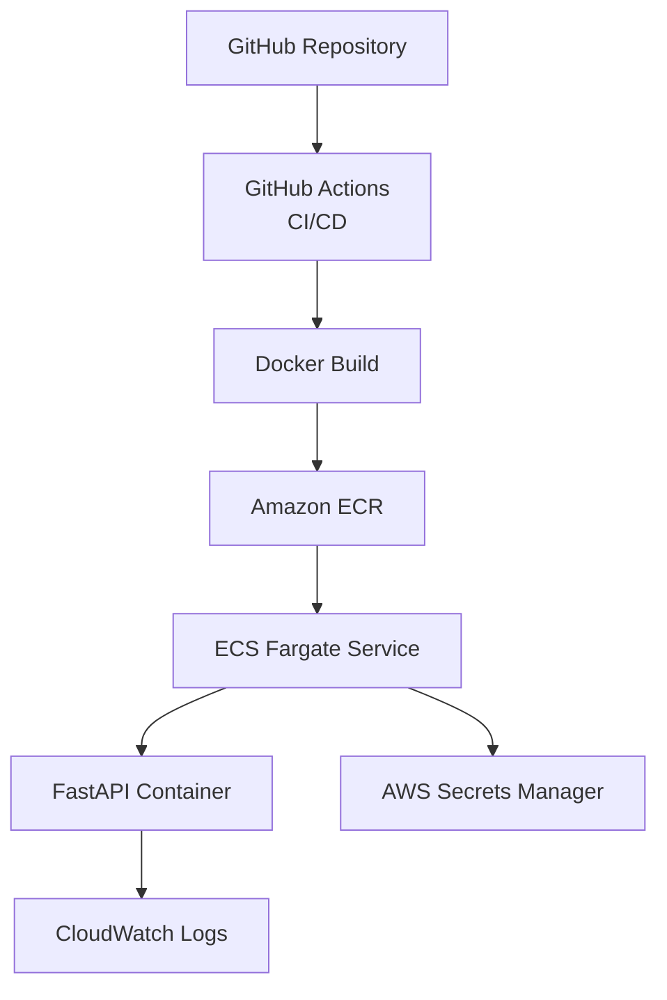
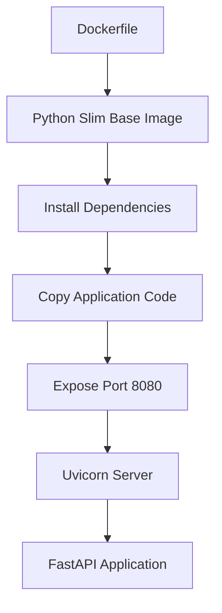

# 📚 Document Portal

A **production‑ready AI Document Intelligence Platform** built with **FastAPI, LangChain, FAISS, and modern LLMs**, capable of **document analysis, document comparison, and conversational RAG‑based document chat**. The project is fully containerized, CI/CD enabled, and deployable on **AWS ECS Fargate**.

---

## 🚀 Key Features

### 🔎 Document Analysis

* Upload PDF documents
* Extract structured metadata using LLMs
* Outputs **strict JSON** using Pydantic schema validation
* Designed for compliance, reports, and enterprise documents

### 🆚 Document Comparison

* Compare **two PDFs** page‑by‑page
* Identify semantic differences using LLM reasoning
* Outputs structured, page‑wise changes
* Useful for contracts, SOPs, policy revisions

### 💬 Document Chat (RAG)

* Chat with **PDF / DOCX / TXT** files
* FAISS vector database for fast retrieval
* Session‑based indexing
* LangChain LCEL pipelines
* Context‑aware, grounded answers

### ☁️ Production‑Grade Architecture

* Dockerized application
* AWS ECS Fargate deployment
* AWS Secrets Manager integration
* CloudWatch logging
* CI/CD via GitHub Actions

---

## 🏗️ System Architecture (High Level)

```
Frontend (HTML/CSS)
        ↓
FastAPI Backend (API Layer)
        ↓
Document Ingestion Layer
        ↓
Embedding Layer
        ↓
Vector Store (FAISS)
        ↓
LLM (Groq / Gemini)
```

---

## 🧩 Detailed Architecture Diagrams (Mermaid)


---

### 1️⃣ Document Ingestion Architecture



---

### 2️⃣ Document Analysis Architecture



---

### 3️⃣ Document Comparison Architecture



---

### 4️⃣ Single / Multi-Document Chat (RAG)



---

### 5️⃣ Advanced Multi-Document Chat



---

### 6️⃣ AWS Deployment Architecture



---

### 7️⃣ Docker Architecture



---

## 🤖 Model Selection Justification

This project intentionally uses **multiple models** to balance **performance, cost, reliability, and scalability** in a production environment.

### 🎯 Design Goals

* Low‑latency responses for real‑time APIs
* Reliable structured JSON output
* Efficient large‑document handling
* Cost‑effective scaling
* No single‑vendor dependency

---

### 🧠 LLM Strategy

#### **Groq – Primary LLM**

* **Why selected**:

  * Ultra‑low inference latency (critical for user experience)
  * High throughput for concurrent requests
  * Suitable for API‑driven workloads
* **Used for**:

  * Document analysis
  * Document comparison
  * RAG‑based chat responses
* **Trade‑off**:

  * Slightly less reasoning depth compared to large proprietary models, mitigated by prompt design

---

#### **Google Gemini – Secondary / Fallback LLM**

* **Why selected**:

  * Strong reasoning and summarization quality
  * Stable structured outputs (JSON compliance)
  * Better handling of long‑context documents
* **Used for**:

  * Metadata extraction
  * Complex document understanding
  * High‑reliability fallback when primary LLM is unavailable
* **Benefit**:

  * Improves system resilience and enterprise reliability

---

### 🔢 Embedding Model Strategy

#### **Sentence‑Transformers (MiniLM)**

* **Model**: `all‑MiniLM‑L6‑v2`
* **Why selected**:

  * Fast embedding generation
  * Good semantic similarity accuracy
  * Low memory footprint (FAISS‑friendly)
* **Used for**:

  * Chunk embeddings
  * Similarity search
  * Single & multi‑document RAG

---

### 🧩 Why This Combination Works

| Component         | Reason                       |
| ----------------- | ---------------------------- |
| Groq LLM          | Speed & scalability          |
| Gemini LLM        | Stability & reasoning        |
| MiniLM Embeddings | Efficient semantic retrieval |
| FAISS             | Fast local vector search     |

This architecture ensures the system is **fast, reliable, cost‑efficient, and production‑ready**.

---

## 💰 Cost vs Performance Comparison

This section explains the **cost–performance trade‑offs** behind the model and infrastructure choices, focusing on building a system that is **fast, scalable, and economically sustainable** in production.

---

### 🧠 LLM Cost vs Performance

| Model                         | Latency | Cost | Reasoning Quality | Primary Usage                                 |
| ----------------------------- | ------- | ---- | ----------------- | --------------------------------------------- |
| **Groq (OSS / LLaMA‑family)** | ⭐⭐⭐⭐⭐   | ⭐⭐⭐⭐ | ⭐⭐⭐⭐              | Real‑time APIs, document analysis, RAG chat   |
| **Google Gemini 2.0 Flash**   | ⭐⭐⭐⭐    | ⭐⭐⭐  | ⭐⭐⭐⭐⭐             | Structured extraction, long‑context reasoning |
| GPT‑4 / Claude (reference)    | ⭐⭐      | ⭐⭐   | ⭐⭐⭐⭐⭐             | Deep reasoning, complex workflows             |

**Rationale**
Groq is used as the default LLM due to its **exceptionally low latency and lower operational cost**, making it ideal for interactive systems. Gemini is selectively used where **output stability and reasoning depth** are more important than response speed.

---

### 🔢 Embedding Model Cost vs Performance

| Embedding Model   | Vector Size | Speed | Memory Usage | Cost | Suitability                         |
| ----------------- | ----------- | ----- | ------------ | ---- | ----------------------------------- |
| **MiniLM‑L6‑v2**  | 384         | ⭐⭐⭐⭐⭐ | ⭐⭐⭐⭐⭐        | Free | High‑throughput RAG systems         |
| BGE‑Large         | 1024        | ⭐⭐⭐   | ⭐⭐           | Free | Higher accuracy, higher memory cost |
| OpenAI Embeddings | 1536        | ⭐⭐⭐⭐  | ⭐⭐           | Paid | Managed, high‑quality embeddings    |

**Rationale**
MiniLM provides an excellent balance between **semantic accuracy, speed, and memory efficiency**, which is critical for FAISS‑based retrieval inside containerized environments.

---

### 📦 Vector Store Cost Comparison

| Vector Store      | Cost       | Speed | Persistence    | Notes                               |
| ----------------- | ---------- | ----- | -------------- | ----------------------------------- |
| **FAISS (Local)** | Free       | ⭐⭐⭐⭐⭐ | File‑based     | Best for ECS & self‑hosted setups   |
| Pinecone          | Paid       | ⭐⭐⭐⭐  | Managed        | Easy scaling, higher recurring cost |
| Weaviate          | Paid / OSS | ⭐⭐⭐⭐  | Managed / Self | Rich filtering, more overhead       |

**Rationale**
FAISS was selected to avoid **recurring managed‑database costs** while maintaining extremely fast retrieval performance.

---

### 🧩 Overall Cost Optimization Strategy

* Use **Groq** for most inference requests to minimize latency and cost
* Use **Gemini** selectively for quality‑critical workflows
* Keep embedding generation **free and efficient** with MiniLM
* Avoid managed vector DB costs by using **FAISS**

This approach prevents **linear cost growth with user scale**, making the system suitable for both startups and enterprise deployments.


---

## 📁 Project Structure

```
document_portal/
├── api/                    # FastAPI application
├── src/                    # Core business logic
│   ├── document_analyzer/  # Document analysis
│   ├── document_compare/   # Document comparison
│   ├── document_chat/      # RAG chat
│   └── document_ingestion/ # File ingestion
├── utils/                  # Config, model loading, helpers
├── models/                 # Pydantic models
├── prompt/                 # Prompt templates
├── static/                 # CSS
├── templates/              # HTML frontend
├── faiss_index/            # Vector store
├── data/                   # Uploaded documents
├── logger/                 # Structured logging
├── exception/              # Custom exceptions
├── infrastructure/         # CloudFormation
├── .github/workflows/      # CI/CD
├── Dockerfile
├── requirements.txt
└── README.md
```

---

## ⚙️ Tech Stack

### Backend

* **FastAPI**
* **LangChain** (LCEL)
* **FAISS** (Vector DB)
* **Pydantic**
* **Structlog**

### LLMs & Embeddings

* Groq (LLaMA / OSS models)
* Google Gemini
* HuggingFace Sentence Transformers

### DevOps & Cloud

* Docker
* AWS ECS Fargate
* AWS ECR
* AWS Secrets Manager
* AWS CloudWatch
* GitHub Actions

---

## 🔐 Environment Variables

For **local development**, create a `.env` file:

```env
GROQ_API_KEY=your_groq_key
GOOGLE_API_KEY=your_google_key
ENV=local
```

For **production**, keys are injected via **AWS Secrets Manager** as a single JSON secret:

```json
{
  "GROQ_API_KEY": "...",
  "GOOGLE_API_KEY": "..."
}
```

---

## 🧪 Running Locally

### 1️⃣ Clone Repository

```bash
git clone https://github.com/nirajj12/DocumentPortal.git
cd DocumentPortal
```

### 2️⃣ Create Virtual Environment

```bash
python -m venv env
source env/bin/activate  # Linux/Mac
```

### 3️⃣ Install Dependencies

```bash
pip install -r requirements.txt
```

### 4️⃣ Run FastAPI

```bash
uvicorn api.main:app --reload
```

### 5️⃣ Open in Browser

```
http://localhost:8000
```

---

## 🐳 Running with Docker

```bash
docker build -t document-portal .
docker run -p 8080:8080 --env-file .env document-portal
```

---

## 🔁 API Endpoints

### Health Check

```
GET /health
```

### Document Analysis

```
POST /analyze
Form‑Data: file=<PDF>
```

### Document Comparison

```
POST /compare
Form‑Data: reference=<PDF>, actual=<PDF>
```

### Build Chat Index

```
POST /chat/index
```

### Chat Query

```
POST /chat/query
```

---

## 🧠 Design Principles

* **Separation of Concerns**
* **Config‑driven architecture**
* **LLM provider abstraction**
* **Session‑isolated indexing**
* **Strict schema validation**
* **Cloud‑ready logging & secrets**

---

## 🚀 CI/CD Pipeline

* **CI**: Runs unit tests on every PR
* **CD**:

  * Build Docker image
  * Push to Amazon ECR
  * Deploy to ECS Fargate

Workflows located in:

```
.github/workflows/
```

---

## 📌 Use Cases

* Enterprise document review
* Contract comparison
* Regulatory compliance
* Knowledge‑base chatbots
* Research document analysis

---

## 🧑‍💻 Author

**Niraj Kumar**
Aspiring  GenAI Engineer

GitHub: [https://github.com/nirajj12](https://github.com/nirajj12)


---

⭐ If you found this project useful, consider starring the repository!
